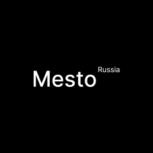

    

<h1 align="center">Проект: Mesto</h1>

Первая версия проекта Mesto, который будет дорабатываться. 

### В планах:
* Добавить возможность загружать свои фото
* Добавить лайки/удаление фото
* Slider 
* Сохранение данных 
* Рефакторинг кода
* И прочее..
##
### В работе используются:
1. Семантические Теги.  
2. БЭМ 
3. Файловая структура по БЭМ - Nested 
4. CSS grid layout
5. Адаптивная верстка 
##
**Github Pages**

* [Ссылка на сайт](https://slimegang13.github.io/mesto/)

